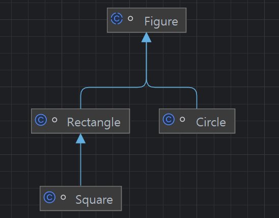

## 핵심 정리

참고) 태그 클래스란 두 가지 이상의 의미를 표현할 때, 그 중 현재 표현하는 의미를 태그(플래그)값으로 알려주는 클래스다.
### 태그 달린 클래스의 단점
* 쓸데없는 코드가 많다.
  * ex) 아래 코드에서 Rectangle 관점에서 필요없는 코드(radius)와
  <br> Cirle 관점에서 필요없는 코드(length, width)들이 함께 있다.
* 가독성이 나쁘다.
* 메모리도 많이 사용한다.
  * 필요없는 field 들이 모두 생성되기 때문에
* 필드를 final로 선언하려면 불필요한 필드까지 초기화해야 한다.
  * final은 반드시 초기화를 해줘야하니까
* 인스턴스 타입만으로는 현재 나타내는 의미를 알 길이 없다.
  * 사각형인지 원인지 알수없다.
<br>
```JAVA
// 코드 23-1 태그 달린 클래스 - 클래스 계층구조보다 훨씬 나쁘다! (142-143쪽)
class Figure {
    enum Shape { RECTANGLE, CIRCLE };

    // 태그 필드 - 현재 모양을 나타낸다.
    final Shape shape;

    // 다음 필드들은 모양이 사각형(RECTANGLE)일 때만 쓰인다.
    double length;
    double width;

    // 다음 필드는 모양이 원(CIRCLE)일 때만 쓰인다.
    double radius;

    // 원용 생성자
    Figure(double radius) {
        shape = Shape.CIRCLE;   // 태깅 작업
        this.radius = radius;
    }

    // 사각형용 생성자
    Figure(double length, double width) {
        shape = Shape.RECTANGLE; // 태깅 작업
        this.length = length;
        this.width = width;
    }

    double area() {
        switch(shape) {
            case RECTANGLE:
                return length * width;
            case CIRCLE:
                return Math.PI * (radius * radius);
            default:
                throw new AssertionError(shape);
        }
    }
}
```

### 클래스 계층 구조로 바꾸면 모든 단점을 해결할 수 있다.
아래와 같이 변경한다.
```JAVA
// 코드 23-2 태그 달린 클래스를 클래스 계층구조로 변환 (144쪽)
abstract class Figure {
    // 너비를 구하는 공식만 있으면 된다.
    abstract double area();
}
```
```JAVA
class Rectangle extends Figure {
    final double length;
    final double width;

    Rectangle(double length, double width) {
        this.length = length;
        this.width  = width;
    }
    @Override double area() { return length * width; }
}
```
```JAVA
class Circle extends Figure {
    final double radius;

    Circle(double radius) { this.radius = radius; }

    @Override double area() { return Math.PI * (radius * radius); }
}
```

